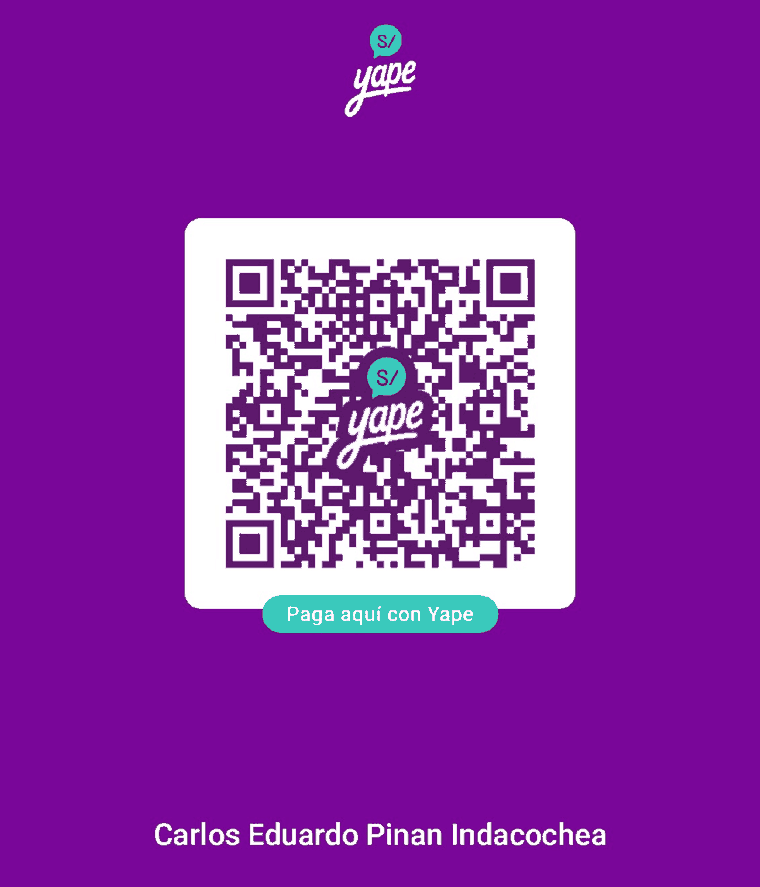
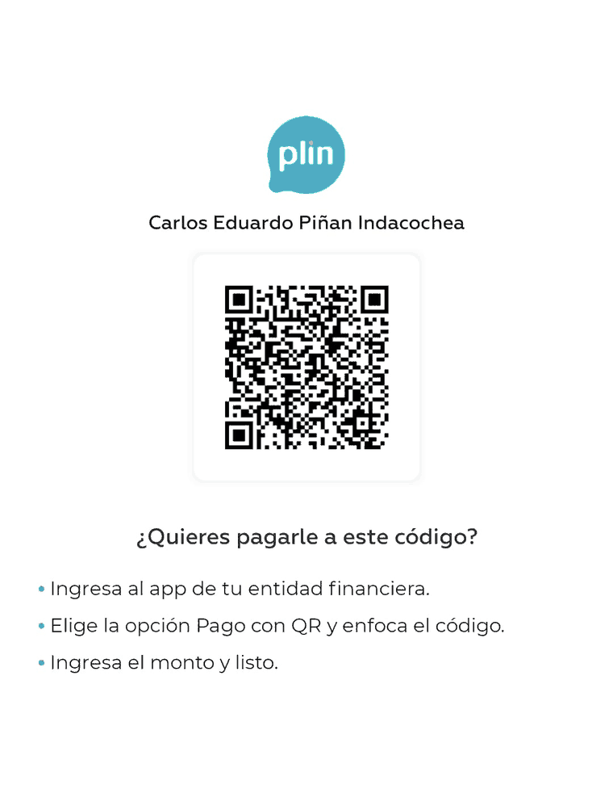

# Apoya Corta Spam

[English](DONATE.md) · [Español]

Corta Spam es gratis, con licencia MIT, sin anuncios, sin rastreo y sin una sola línea de código
de red — así que no genera dinero, y nunca lo hará. No hay versión de pago, no hay build "pro",
no hay ninguna función detrás de un muro, y donar no te da nada extra. Si la app te ahorró unas
cuantas llamadas basura y quieres agradecerlo, esta página explica cómo.

Todo lo que llegue va al mantenedor, [Carlos Piñán](https://github.com/cpinan), a título
personal. No es una empresa ni una ONG, y las donaciones **no son deducibles de impuestos**.

---

## Formas gratuitas de ayudar (valen más que el dinero)

No cuestan nada y varias ayudan más que una donación:

- ⭐ **Dale una estrella al repo** — [cpinan/Corta-Spam](https://github.com/cpinan/Corta-Spam)
- 📝 **Califica la app en Google Play** — la calificación es lo que decide si alguien más la encuentra
- 🌍 **Traduce un idioma** — la app trae inglés, español (LATAM), portugués (Brasil) e hindi en
  tres árboles de recursos; un idioma nuevo es una contribución completa y autocontenida
- 🐞 **Reporta un bug bien** — modelo de teléfono, versión de Android, qué esperabas, qué pasó
- 🔍 **Audita lo que promete la privacidad** — "tus datos nunca salen del dispositivo" se puede
  comprobar contra el código, y que se compruebe es justamente para lo que se publica

---

## Dinero

### Internacional

| Método | Enlace | Comisión de plataforma | Notas |
|---|---|---|---|
| **GitHub Sponsors** | **[github.com/sponsors/cpinan](https://github.com/sponsors/cpinan)** | **0%** — GitHub no se queda con nada | Es lo mismo que el botón **Sponsor** arriba del repo. Hace falta una cuenta de GitHub; paga vía Stripe |
| **Ko-fi** *(sin cuenta)* | **[ko-fi.com/carlospinan](https://ko-fi.com/carlospinan)** | **0%** en propinas | Quien dona no necesita cuenta propia — basta una tarjeta. El "invítame un café" de menor fricción |
| **PayPal** | **[paypal.me/carlospinan](https://paypal.me/carlospinan)** | ninguna, aparte de lo que cobra PayPal | Directo, sin intermediarios |

Ninguno de los tres es recurrente, a propósito — los niveles mensuales de GitHub Sponsors y las
membresías mensuales de Ko-fi están desactivados, porque una membresía es la promesa de entregar
algo cada mes y aquí no hay nada que entregar.

Ko-fi y PayPal terminan en la **misma cuenta de PayPal**; GitHub Sponsors termina en Stripe. Solo
cambian en lo que ve quien dona, así que elige el que te resulte menos molesto, no el que creas
que me cuesta menos. La comisión internacional y el cambio de moneda de PayPal se aplican igual a
esos dos, y en una propina pequeña no son poca cosa.

### Perú 🇵🇪

Nacional, instantáneo y **sin comisión para ninguna de las dos partes** — para quien ya está
dentro del sistema bancario peruano es la mejor opción, sin discusión, y se salta por completo el
cambio de moneda:

<table>
<tr>
<th width="50%">Yape</th>
<th width="50%">Plin</th>
</tr>
<tr>
<td align="center"></td>
<td align="center"></td>
</tr>
<tr>
<td>Escanéalo desde el lector de QR de la app de <b>Yape</b>. Es una billetera del BCP y funciona desde el Yape de cualquier banco.</td>
<td>Entra al app de tu entidad financiera → <b>Pago con QR</b>. Funciona desde el app de cualquier banco peruano, para quien no usa Yape.</td>
</tr>
</table>

Los archivos a tamaño completo: [`docs/donate/yape-qr.png`](docs/donate/yape-qr.png) ·
[`docs/donate/plin-qr.png`](docs/donate/plin-qr.png).

Escanea el QR en vez de escribir un número de celular — el QR lleva la cuenta sin publicar un
número personal a todo el que lea este archivo. Las dos imágenes se decodificaron antes de
subirlas y ninguna lleva un número dentro; la comprobación está en
[`docs/donate/README.md`](docs/donate/README.md).

---

## Por qué estos y no otros

- **GitHub Sponsors va primero** porque GitHub no se queda con nada y es la única opción que no
  manda a quien dona a otro sitio — el botón **Sponsor** y su ventana son parte del repositorio.
  Estuvo fuera hasta el 2026-08-27 por un tema de cobro, no de preferencia: paga a través de una
  cuenta de Stripe Connect cuyo país tiene que coincidir con el del banco, y esa cuenta ya está
  aprobada. La ruta sin banco — un *fiscal host* como Open Source Collective, 10% de comisión y
  solo elegible al registrarse — al final no hizo falta.
- **Ko-fi va segundo, y sigue siendo lo más fácil para quien no es programador**, porque quien dona
  no necesita cuenta, le basta una tarjeta, la plataforma se queda con 0% de una propina única, y
  paga a PayPal — sin otro proceso bancario en el que atascarse.
- **Liberapay se evaluó y se descartó.** Es una ONG que no se queda con nada y, con Stripe, sería la
  respuesta correcta para apoyo *recurrente*. Stripe ya está disponible aquí, pero la razón para
  dejarlo fuera sobrevive: lo recurrente se descarta a propósito, y el otro riel de Liberapay es
  PayPal, que obliga a quien dona a confirmar *cada pago* — así que lo recurrente es solo de
  nombre — y además muestra los nombres y correos de quien dona y de quien recibe, el uno al otro.
  Eso es un `paypal.me` peor con una cuenta extra de por medio.
- **Yape/Plin van aparte** porque para quien dona desde Perú no cuestan nada, llegan al instante
  y se saltan el cambio de moneda — mandar a un peruano por PayPal quemaría un porcentaje de dos
  dígitos de una propina pequeña en comisiones, sin ninguna razón.
- **Open Collective** (libro de cuentas público y detallado) queda fuera por lo de siempre: esto es
  un solo mantenedor sin gastos que rendir en público, así que la transparencia que ofrece todavía
  no tiene nada en qué gastarse.
- **Sin cripto.** Sumaría una billetera que mantener y una pregunta tributaria que responder,
  para un volumen de donación que no justifica ninguna de las dos.
- **Dentro de la app no se pide nada.** Corta Spam no tiene aviso de donación, ni pantalla que
  insista, ni código de cobros; toda la petición vive aquí, en el repositorio. Es una decisión
  deliberada, no un olvido.

---

## Para qué NO es el dinero

No hay una hoja de ruta que se desbloquee al llegar a un monto, ni cola de recompensas, ni
promesa de que donar compre atención a una petición de función. La app está lo bastante terminada
para usarse y se mantiene porque el mantenedor la usa. Toma cualquier aporte como un gracias por
lo que ya está publicado.
