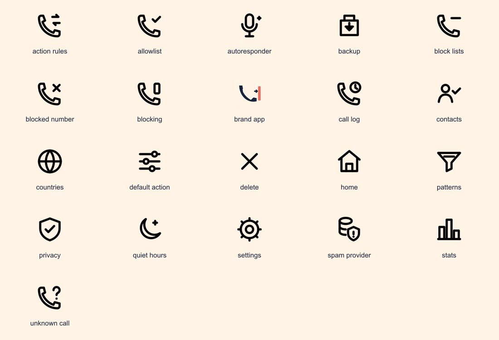

# Corta Spam iconography

The icon system uses a clear telephone metaphor without entering WhatsApp's
green, circular, or chat-bubble visual territory. The production identity is
named **Call Barrier**: a navy handset approaches a coral filtering boundary on
a warm cream field.



## Brand palette

| Token | Value | Use |
|---|---:|---|
| Midnight navy | `#17233C` | Handset, primary identity, dark glyphs |
| Call coral | `#EF6A5B` | Blocking boundary and destructive emphasis |
| Warm cream | `#FFF4E6` | Launcher background and light presentation field |

Green is deliberately excluded from the launcher identity. In-app icons are
monochrome resources and inherit the active Compose color scheme through tint.

## Construction

- Interface glyph canvas: `24 × 24`.
- Standard stroke: `1.8`, with round caps and joins.
- Launcher foreground canvas: `108 × 108 dp` on Android.
- Android critical artwork stays within the central `66 × 66 dp` safe zone.
- iOS source canvas: full-bleed, opaque `1024 × 1024 px`; the system applies
  the final corner mask.
- Filled shapes are reserved for the launcher identity. Interface glyphs use
  rounded outlines for visual consistency.

## Semantic inventory

| Resource | Meaning |
|---|---|
| `ic_brand_app` | App identity in welcome and onboarding |
| `ic_home` | Dashboard |
| `ic_call_log` | Screened-call history |
| `ic_block_lists` | Blocking rules hub |
| `ic_settings` | Settings |
| `ic_blocked_number` | Exact-number blocking |
| `ic_allowlist` | Always-allowed numbers or contacts |
| `ic_patterns` | Pattern and prefix filtering |
| `ic_countries` | Country-code rules |
| `ic_action_rules` | Repeated-call/action rules |
| `ic_quiet_hours` | Scheduled blocking |
| `ic_autoresponder` | Scripted auto-responder |
| `ic_spam_provider` | External spam-data provider |
| `ic_stats` | Blocking statistics |
| `ic_backup` | Backup, restore, and import |
| `ic_privacy` | Privacy information |
| `ic_default_action` | Default unmatched-call behavior |
| `ic_contacts` | Contact allowlisting and permission |
| `ic_blocking` | Master screening state |
| `ic_unknown_call` | Unknown or withheld number |
| `ic_delete` | Remove or dismiss an item |

## Interaction and accessibility

- Navigation and feature-card icons are decorative when an adjacent label
  already names the destination, so they use a null content description.
- Standalone icon buttons must provide a localized content description.
- Outcome color is never the only signal: blocked, allowed, and unknown states
  retain distinct glyphs and text labels.
- Icons must not be stretched. Use `24 dp` for normal interface placement and
  `20 dp` only in dense supporting metadata.

## Source and platform assets

- Vector master: `design/iconography/app-icon-master.svg`
- Android monochrome master: `design/iconography/app-icon-monochrome.svg`
- Editable interface SVGs: `design/iconography/ui/`
- Shared UI PNG derivatives: `shared/src/commonMain/composeResources/drawable/`
- Android adaptive icons: `androidApp/src/main/res/mipmap-anydpi-v26/` and
  `mipmap-anydpi-v33/`
- iOS app icon catalog: `iosApp/iosApp/Assets.xcassets/AppIcon.appiconset/`

The SVG masters are authoritative. Raster outputs should be regenerated from
the master rather than edited directly.

## Regenerating shared interface PNGs

The renderer validates the SVG root attributes, produces `96 × 96` RGBA PNGs,
and verifies transparency, visible solid artwork, monochrome black pixels, and
the brand icon's navy/coral colors.

```sh
NODE_PATH=/path/to/node_modules node design/iconography/render_ui_icons.mjs
```

Install Sharp first when it is not already available:

```sh
npm install --no-save sharp
```
