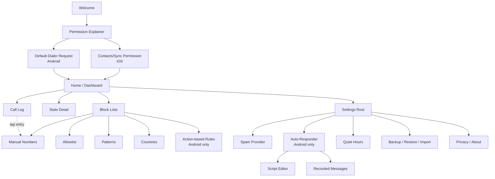

# Screen Map & Navigation

Full-screen navigation (no nested tab-bar-within-tab-bar patterns — Compose Multiplatform `NavHost`, single back-stack per top-level destination). Screens are grouped by the milestone that introduces them; iOS omits the Android-only screens per `SPEC.md` §1.

## Screen inventory

| Screen | Introduced in | Platforms |
|---|---|---|
| Welcome / first-launch | M1 | Both |
| Permission explainer (why default-dialer is being requested) | M1 | Android |
| Default-dialer request + status | M1 | Android |
| iOS permission explainer (Contacts, CallDirectory sync) | M1 | iOS |
| Home / Dashboard (today's blocked count, quick toggle, recent activity) | M2/M9 | Both |
| Call log (all calls, block reason shown) | M2 | Both |
| Block list — manual numbers | M2 | Both |
| Allowlist (contacts + manual) | M2 | Both |
| Block list — patterns | M3 | Both (creation UI flags iOS-unsupported patterns inline) |
| Block list — countries | M4 | Both |
| Action-based rule config | M5 | Android only |
| Auto-responder settings (enable/disable) | M6 | Android only |
| Auto-responder script editor | M6 | Android only |
| Auto-responder recorded messages (caller voicemail) | M6 | Android only |
| Quiet hours schedule | M8 | Both |
| Stats detail (blocked calls over time) | M9 | Both |
| Settings — root | M2+ | Both |
| Settings — spam provider (feature 5 toggle) | M7 | Both |
| Settings — backup/restore/import | M10 | Both |
| Settings — privacy/about | M11 | Both |

## Navigation graph



## Navigation principles

1. **Home is the only bottom-nav-adjacent hub.** Four top-level destinations reachable from Home: Call Log, Stats, Block Lists, Settings. Everything else is a drill-down, always with a back button — no dead ends, no modal-only screens for anything that should be revisitable (e.g. the script editor is a real screen, not a dialog, because users will want to re-edit it).
2. **iOS never shows an Android-only screen as a broken link.** `BLAction` and the auto-responder subtree simply don't exist in the iOS nav graph — they are not present-but-disabled. A single line in Settings ("Action-based rules and the auto-responder require Android's call-audio access, which iOS doesn't expose to third-party apps") replaces the missing menu items, linking out to a short explainer, per SPEC §1.
3. **Call Log entries deep-link to the rule that blocked them** (`CallLog -.-> BLManual` in the graph above is illustrative — the actual target depends on which rule type fired), so "why did it block this" is always one tap away, addressing gap #6 in SPEC §2.
4. **No screen requires network to render.** Every screen in this graph functions fully offline; only `SetSpam`'s optional provider call and iOS's optional Live Caller ID Lookup touch the network, and both are off by default.

---

## Prompt for Claude (design pass)

Paste the block below into a fresh Claude conversation (or `/artifact-design` context) once you're ready to turn this into actual screen mockups. It's self-contained — it doesn't assume the model has seen this conversation.

```
You are designing screens for BloqueaLlamadas, an open-source call-blocking
app (Android + iOS via Kotlin Multiplatform + Compose Multiplatform).
Produce high-fidelity mockups (as an HTML/CSS artifact, one scrollable page
per screen or a tabbed set) for the following screens, in this priority
order:

1. Home / Dashboard — today's blocked-call count, a prominent on/off master
   toggle, last 3-5 blocked calls with the reason each was blocked, quick
   access to the 4 hubs (Call Log, Stats, Block Lists, Settings).
2. Permission explainer (Android default-dialer request) — this is the
   single highest-risk screen for user trust. It must clearly explain WHY
   the app needs to become the default phone app (to screen calls and
   power the auto-responder) BEFORE the OS permission dialog appears, in
   plain language, with an explicit "what we will never do with this"
   reassurance (no call recording without a separate toggle, no data
   leaves the device, open source / link to source).
3. Call Log — list of all calls, each row shows number/contact name,
   timestamp, and a colored tag for the outcome (allowed / blocked +
   which rule fired). Tapping a blocked entry shows the specific rule.
4. Block Lists hub — four entry points (Manual, Allowlist, Patterns,
   Countries), each showing a live count badge.
5. Manual number block list — add/remove numbers, swipe-to-delete pattern,
   empty state that explains the feature instead of a blank list.
6. Auto-responder script editor (Android only) — a simple text field for
   the greeting script, a live TTS preview button, a separate clearly-
   dangerous-looking toggle for "record caller's message" that, when
   enabled, forces a non-removable consent line into the script preview.
7. Settings root — grouped list (Blocking rules, Auto-responder, Spam
   provider [off by default, one-line privacy note], Quiet hours, Backup
   & restore, Privacy & about), with a visible "0 ads, 0 trackers, works
   offline" badge somewhere on this screen or Home.

Design constraints:
- Utilitarian, high information density, NOT playful or social — this is
  explicitly not a social app. Think "a well-made settings app," not "a
  consumer social feed."
- Must read as trustworthy to a non-technical user being asked for scary
  phone permissions. Calm color palette, no dark patterns, no urgency
  language, no upsell anywhere (there is no paid tier).
- Support both light and dark mode.
- Every screen must make sense with zero data (empty states are not an
  afterthought).
- On any screen with an Android-only feature, if you're asked to also
  design the iOS equivalent, show the honest "not available on iOS, here's
  why" state rather than a disabled/greyed-out control.
- Respect platform idiom loosely (Material-ish on Android surfaces,
  slightly more iOS-native spacing/typography on iOS surfaces) but keep
  the underlying layout/IA identical, since both are driven by the same
  Compose Multiplatform UI code.

Output: a single self-contained HTML artifact, one section per screen,
with a simple in-page nav to jump between them.
```
